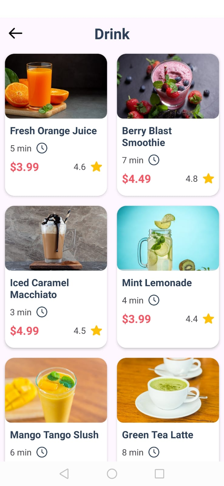

# FoodApp
Una aplicación al estilo de las principales app de comida rapida como Rappi y DidiFood
que permite ver los distintos platillos de un restaurante. La comida se agrupa por categorías 
y permite ver los detalles de cada platillo. Asimismo, permite agregar al carrito de compras las distinas comidas 
a gusto del usuario mediante una interfaz llamativa. Calcula las sumas totales y parciales 
de cada cantidad de platillos para a ordenar.

Para el almacenamiento de imagenes, usuarios e información se usa Firebase.

A continuacion los diseños funcionales:

Interfaces de inicio

  
  
  

Interfaces de la pantalla principal y el buscador

  
  

Interfaces lista de productos por categorias

  
  

Interfaces de detalles de cada plato

  
  

Interfaces para gestionar los pedidos

  
  

